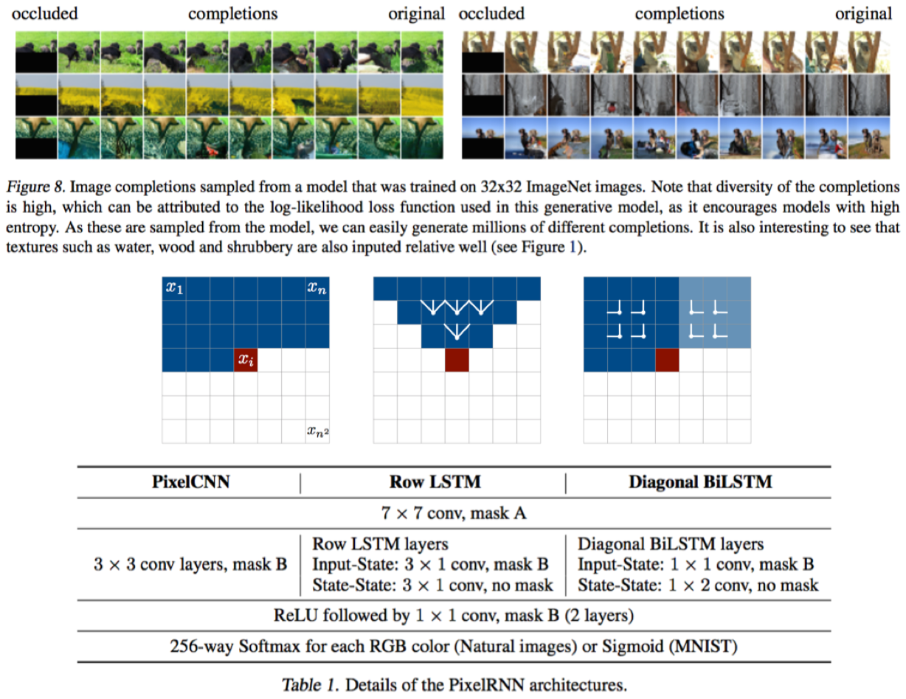

# PixelCNN & PixelRNN in TensorFlow

TensorFlow implementation of [Pixel Recurrent Neural Networks](https://arxiv.org/abs/1601.06759). This implementation contains:

1. PixelCNN
  - Masked Convolution (A, B)
2. PixelRNN
  - Diagonal BiLSTM (skew, unskew)
  - Residual Connections

## Requirements

- Python 2.7
- [Scipy](https://www.scipy.org/)
- [TensorFlow](https://www.tensorflow.org/) 0.9+

## Usage

First, install prerequisites with:

    $ pip install tqdm gym[all]

To train a `pixel_cnn` model with `mnist` data (very fast):

    $ python main.py --data=mnist --model=pixel_cnn --out_recurrent_length=3

To train a `pixel_rnn` model with `mnist` data (slow):

    $ python main.py --data=mnist --model=pixel_rnn --out_recurrent_length=3

To generate images with trained model: 

    $ python main.py --data=mnist --model=pixel_cnn --out_recurrent_length=3 --is_train=False

## Results

The current implementation of `pixel_rnn` is complicated so the training is slower than `pixel_cnn`.

(in progress)

## References

- [Pixel Recurrent Neural Networks](https://arxiv.org/abs/1601.06759)
- [Conditional Image Generation with PixelCNN Decoders](https://arxiv.org/abs/1606.05328)
- [Review by Kyle Kastner](https://github.com/tensorflow/magenta/blob/master/magenta/reviews/pixelrnn.md)
- [kundan2510/pixelCNN](https://github.com/kundan2510/pixelCNN)
- [zhirongw/pixel-rnn](https://github.com/zhirongw/pixel-rnn)

## Author

Taehoon Kim / [@carpedm20](http://carpedm20.github.io/)
